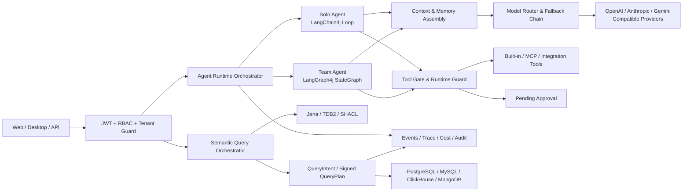
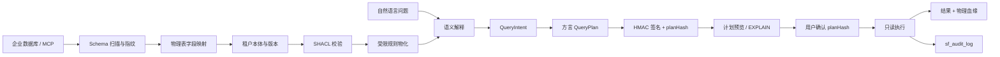
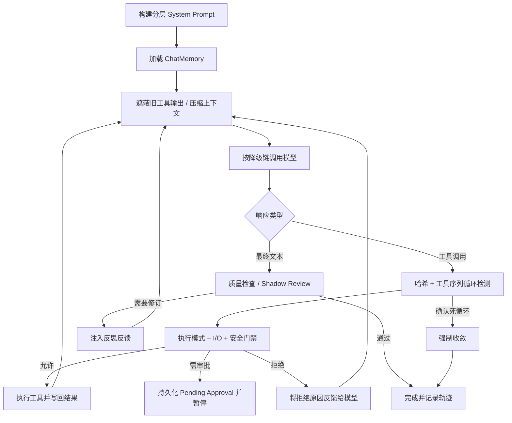
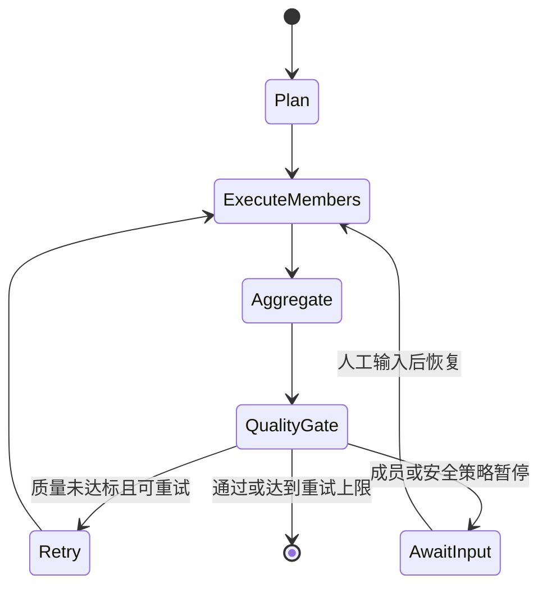
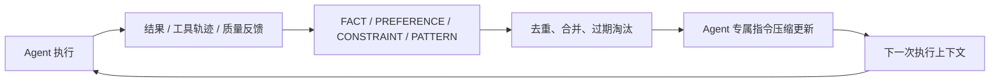
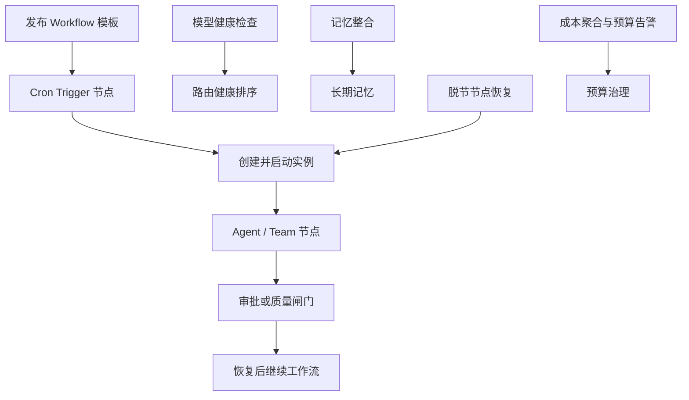

# SchemaPlexAI Server

> 面向企业研发协作场景的 Agentic AI Platform Backend

[](https://openjdk.org/)
[](https://spring.io/projects/spring-boot)
[](https://docs.langchain4j.dev/)
[](https://github.com/bsorrentino/langgraph4j)
[](https://jena.apache.org/)
[](#权利声明)

SchemaPlexAI Server 是一个以 **Agent 执行内核、Multi-Agent 协作图、分层记忆、本体驱动数据查询、模型路由和可信治理** 为核心的 AI 研发协作平台服务端。它不是将大模型包装成几个聊天接口，而是尝试回答一个更难的问题：

> 当 AI 开始读取企业知识、调用工具、修改外部状态并参与研发流程时，如何让它具备持续执行能力，同时仍然可观察、可暂停、可恢复、可审计、可授权？

项目作为个人作品完成于 **2026 年 4 月**。公开仓库用于展示架构与工程实现，不包含生产配置、数据库 SQL 与任何第三方凭据。

## 项目导航

- [SchemaPlexAI Web](https://github.com/chisss/schemaplexai-web-portfolio)：平台控制台、Agent 运营与可视化编排
- [SchemaPlexAI Desktop](https://github.com/chisss/schemaplexai-desktop-portfolio)：Flutter + Rust 本地优先工作台
- [SchemaPlexAI Official Website](https://github.com/chisss/schemapplexai-official-web-portfolio)：产品能力与界面展示站

## 设计哲学

### 1. Agent 是受约束的执行系统，不是无限循环的聊天机器人

模型负责推理和提出工具调用，但执行轮次、工具集合、上下文预算、模型降级、安全判定和最终收敛均由确定性代码控制。每次执行都有独立 `executionId`、状态、事件、Token 用量、模型轨迹和父子执行关系。

### 2. 先建立控制平面，再开放行动能力

所有写操作都要经过执行模式、工具 I/O 类型、沙箱策略、待审批门禁和运行时安全策略。风险决策不是 Prompt 中的一句提醒，而是可以返回 `ALLOW / WARN / PAUSE / BLOCK` 的业务状态，并联动审批、事件和审计记录。

### 3. 上下文是稀缺资源，需要分层、检索和预算

系统不会把所有历史与知识一次性塞入 Prompt。静态指令、全局知识、绑定上下文、RAG 命中、团队证据、用户偏好、Agent 长期记忆与当前任务分别装配，并为每层分配独立预算；长会话还会执行旧工具输出遮蔽与摘要压缩。

### 4. Multi-Agent 的价值来自显式协作协议

Team Agent 不是简单并发调用多个模型。成员拥有独立角色、上下文、工具、模型和执行预算；Contributor 产生可追溯证据，Leader 基于上游事实汇总，质量闸门决定结束、反思重试或等待人工输入。

### 5. 模型是可替换基础设施，而不是业务代码依赖

业务层依赖统一模型配置和路由能力。OpenAI Compatible、Anthropic Messages 与 Gemini 使用同一运行时抽象，模型组可形成降级链或负载均衡池，路由会结合近期错误率、P95 延迟和连通性动态重排。

### 6. 企业数据查询需要可治理的语义层

自然语言不能直接变成任意 SQL。系统先把数据库 Schema 映射为带版本的业务本体，再将问题解释为结构化 `QueryIntent`，由服务端编译、签名和执行 `QueryPlan`。语义映射、物理血缘、查询限制与审计记录共同决定一次查询是否可信。

## 核心架构



运行时根据 Agent 类型选择不同引擎：

- `solo`：使用 LangChain4j 实现可控的 Agentic Loop。
- `team`：使用 LangGraph4j 实现可 checkpoint、可恢复的 Agentic Graph。
- 两种运行时共享模型路由、上下文装配、工具门禁、记忆、质量与安全基础设施。

## 本体驱动的企业数据查询

平台通过数据库 MCP 数据源连接 PostgreSQL、MySQL、ClickHouse 和 MongoDB，将物理 Schema、业务概念和自然语言查询组织为一条受治理的数据分析链路。这里的本体不是用于展示的静态知识图谱，而是数据库字段到业务语义、查询计划和结果血缘之间的可执行控制面。



### 语义目录与本体生命周期

- **多数据库 Schema 快照**：关系型数据库读取表、列、约束和索引，ClickHouse 读取引擎与分区元数据，MongoDB 读取集合、字段类型分布和索引；规范化后计算稳定 SHA-256 fingerprint。
- **版本化语义模型**：模型、版本、Schema 快照和活动版本均按租户隔离；草稿通过 revision 乐观锁编辑，发布版本不可退回为可编辑状态。
- **Jena Named Graph 隔离**：服务端生成租户与版本对应的图 IRI，TDB2 Dataset 由统一生命周期管理器持有；业务代码只能通过只读租户视图访问白名单图。
- **可视化本体编辑**：后端提供模型库、版本、本体节点/关系、邻域分页和物理映射 REST 契约，前端以三栏工作台和 G6 图谱完成轻量编辑与问题定位。
- **SHACL 与轻量推理**：发布前执行 SHACL 校验，只物化子类、子属性、domain、range、等价类和等价属性等白名单规则；不启用完整 OWL DL，也不执行租户自定义脚本规则。
- **原子发布边界**：发布过程使用 operationId 临时图、稳定 checksum、三元组硬配额和失败清理；活动版本只在数据库状态转换成功后切换。

### 从自然语言到受控查询

1. `POST /semantic/query/interpret` 在已发布语义版本内解析指标、维度、过滤条件和时间范围，返回 `READY / CLARIFICATION / REJECTED`，歧义必须先澄清。
2. `POST /semantic/query/plan` 由服务端从 `QueryIntent` 编译参数化计划，客户端不能提交 SQL、SPARQL、Mongo pipeline 或物理字段映射。
3. PostgreSQL、MySQL、ClickHouse 编译为参数化 SQL；MongoDB 编译为受控 aggregation pipeline。计划同时携带结果列、语义 IRI 和物理表字段血缘。
4. 服务端为计划计算 `planHash` 并签发 HMAC。`POST /semantic/query/explain` 只返回计划信息，执行前客户端必须提交与当前重建计划一致的 `expectedPlanHash`。
5. `POST /semantic/query/execute` 执行只读计划，返回结构化结果、截断状态、耗时和血缘。问题、上下文或语义版本变化后，旧计划不能继续复用。

### 执行安全与审计

| 边界 | 实现 |
| --- | --- |
| 租户隔离 | 数据源、Schema 快照、模型版本、Jena 图和审计记录均显式绑定 `tenantId` |
| SQL 安全 | JSQLParser AST 只读门禁、单语句限制、参数安全绑定、最大行数与超时 |
| MongoDB 安全 | 单集合 aggregation、JSON 节点参数绑定、阶段/操作符白名单、16 阶段、64 KiB、12 层深度限制 |
| MCP 契约 | 仅接受受控 aggregation/explain 工具别名；可按 `inputSchema` 协商参数名和 pipeline 表示，未知工具拒绝执行 |
| 计划完整性 | 服务端重建计划、HMAC 签名、`planHash` 确认，阻止客户端替换查询文本或物理映射 |
| 数据最小化 | EXPLAIN 不返回业务数据；Schema 快照不保存样例值；结果按行数限制截断 |
| 持久化审计 | `sf_audit_log` 记录租户、用户、动作、planHash、数据源、结果状态、行数和耗时 |
| 敏感信息边界 | 审计不保存自然语言原文、SQL、pipeline、参数值、结果行或数据库凭据 |

本体图用于确定“业务问题对应哪些数据”，QueryPlan 用于确定“允许怎样查询这些数据”。向量检索可以辅助知识召回，但不会替代确定性的物理映射、方言编译和数据库只读门禁。

## Agentic Loop：从模型响应到可信结果

`AgentExecutionEngine` 将一次 Agent 执行组织为有边界的闭环：



### Loop 的工程化细节

- **分层 Prompt 装配**：Agent 指令、全局知识、绑定上下文、检索知识、用户记忆和运行时上下文分别构建。
- **动态工具面**：每轮根据 Skill、MCP、本地绑定和执行上下文生成有效工具集合，未开放工具即使被模型请求也不会执行。
- **双层循环检测**：同时观察响应哈希和工具调用序列；确认死循环或告警累计超阈值后进入强制收敛。
- **上下文预算治理**：旧工具输出先遮蔽，再根据模型上下文窗口压缩 ChatMemory，避免长任务无限膨胀。
- **模型韧性**：单模型内部支持超时与重试，模型之间支持 Primary → Secondary → Tertiary 降级链。
- **质量反思**：最终文本可经过即时规则检查或异步 Shadow Review；未通过时反馈到下一轮修订，而不是直接返回低质量结果。
- **可恢复审批**：写工具命中门禁后生成 `PendingToolApproval`，执行进入 `PAUSED`；审批后可重建工具请求并从原执行继续。
- **强制收敛与降级输出**：轮次耗尽、空响应但已有证据、循环或模型异常时，系统尝试生成基于现有证据的可交付结果。
- **完整可观测性**：轮次、工具调用、Token、耗时、fallback、质量反馈和状态变更均进入事件流与 Trace。

## Multi-Agent 与 Agentic Graph

Team Agent 使用 LangGraph4j `StateGraph<TeamGraphState>` 建模，而不是在 Service 中堆叠分支逻辑。



### 协作模型

- **角色约束**：一个 Team 必须且只能有一个 Leader；Contributor 必须绑定自己的业务上下文。
- **成员隔离**：每个成员创建独立子执行，拥有独立会话、工具绑定、系统上下文、模型覆盖和最大轮次。
- **证据传递**：Contributor 默认流水线执行，后续成员读取上游已确认事实；Leader 最后基于成员证据生成最终交付物。
- **可选并行能力**：运行时具备 `CompletableFuture` 批量执行能力；当前默认采用流水线模式，优先保证证据传递和外部模型稳定性。
- **质量闸门**：聚合结果经过质量判断，失败时携带上一轮反馈重新执行成员，而不是无条件接受第一次输出。
- **Checkpoint**：Graph 状态由 PostgreSQL Saver 持久化，使用 `threadId` 与 namespace 隔离；暂停时保留 checkpoint，完成后释放。
- **Human-in-the-loop**：安全暂停、工具审批或补充输入都可以成为图上的等待状态，恢复后继续原图，而非从头执行。
- **父子追踪**：父执行与成员执行通过 `parentExecutionId`、`teamMemberId` 和独立事件关联，可定位具体角色的失败与成本。

## 分层记忆体系

平台区分“消息存储”“Agent 经验”“用户偏好”和“外部知识”，避免所有内容混成一段不可治理的聊天历史。

| 记忆层 | 存储与生命周期 | 写入方式 | 使用方式 |
| --- | --- | --- | --- |
| 会话记忆 | Redis L1 + PostgreSQL L2 | 每轮模型消息与工具结果持久化 | Redis 命中优先，未命中回源 PostgreSQL 并回填缓存 |
| Agent 原始记忆 | PostgreSQL，按租户与 Agent 隔离 | 执行完成后异步从对话提取 `FACT / PREFERENCE / CONSTRAINT / PATTERN` | 作为两阶段长期记忆管线的原料 |
| Agent 合并记忆 | PostgreSQL，带相关度和过期时间 | 主模型去重、合并互补信息并淘汰过时条目 | 取高相关记忆注入后续任务 |
| 用户显式记忆 | PostgreSQL，按用户、Agent、项目作用域隔离 | 仅识别“请记住”等显式表达；临时会话和关闭记忆时不写入 | 分为静态画像与当前任务相关记忆注入 Prompt |
| RAG 知识 | Milvus + 业务上下文存储 | 文档与 Context 进入向量检索链路 | LangChain4j Retriever 优先，Milvus 与词法检索提供 fallback |
| Team 共享证据 | Redis 团队上下文 + Graph State | 成员执行后写入摘要与结果 | 后续 Contributor 和 Leader 消费上游证据 |

### 上下文装配层级

```text
L4       Agent 专属指令                       最高优先级
L1       全局知识
L1.5     Agent 绑定的项目 / 工作区上下文
L2.5     RAG 语义检索或词法 fallback 结果
L_team   Team Agent 成员产出
L_user   用户画像、偏好与任务相关记忆
L_memory Agent 跨会话长期记忆
L3       当前任务与运行时角色上下文
```

每层具有独立字符预算。静态部分可缓存，用户记忆不会进入 Agent 共享静态缓存；临时对话同时关闭用户记忆读取与自动提取，减少隐私泄漏和上下文串扰。

## 权限、租户与可信执行

平台采用从 HTTP 入口到工具执行的纵深防护，而不是只在 Controller 上做一次角色判断。

### 身份与权限

- JWT 携带 `userId`、`tenantId` 和角色，过滤器验证后写入 Spring Security 与线程上下文。
- RBAC 权限从用户角色动态加载，支持 `*` 超级权限、标准权限码和兼容别名。
- Controller 使用 `@PreAuthorize` 将 Agent、Workflow、Approval、Cost、Security、System 等操作映射到细粒度权限。
- Super Admin 仅作为显式角色放行，不通过猜测用户名或租户身份获得特权。

### 多租户隔离

- 请求租户来自已验证 JWT；普通用户不能通过自定义 Header 切换到其他租户。
- MyBatis-Plus `TenantLineInnerInterceptor` 自动为业务 SQL 注入 `tenant_id` 条件。
- 新增实体时由 MetaObjectHandler 自动填充租户标识，降低开发遗漏风险。
- 系统表使用明确白名单跳过租户插件；跨租户操作必须进入系统租户上下文。

### 工具与运行时安全

- 工具声明 `READ / WRITE / READ_WRITE` I/O 类型，执行模式决定当前任务能否读写。
- Sandbox Policy 为 Agent 与 Team Member 生成执行快照，记录允许命令、路径和能力边界。
- 写操作可以被转换为持久化审批项，审批结果与原始工具请求绑定。
- Security Runtime Guard 根据策略、规则包、目标选择器与内容风险返回 `ALLOW / WARN / PAUSE / BLOCK`。
- 非 `ALLOW` 决策可生成安全事件，并记录 trace、命中规则、处置建议与审计状态。
- 启动安全校验阻止生产环境携带默认密钥或不安全配置启动。

## 模型接入与路由特色

### 多协议统一

| 协议 | 原生支持 | 特色 |
| --- | --- | --- |
| OpenAI Compatible | OpenAI、DeepSeek、Kimi 及兼容网关 | 自定义 Base URL、流式输出、Reasoning Effort |
| Anthropic Messages | Claude 原生协议 | Thinking Budget 映射、同步与流式模型 |
| Gemini | Google Gemini | Thinking Level、同步与流式模型 |

模型 API Key 以加密字段保存，运行时解密；模型实例按协议、模型、地址、上下文窗口、超时和推理强度生成缓存键复用。

### 路由能力

- **模型组**：同一 use case 下组织多个模型，按顺序形成 fallback chain。
- **显式路由**：Primary / Secondary / Tertiary 构成三级候选链。
- **健康感知重排**：结合 1 分钟错误率、P95 延迟、最近连通性与测试延迟重新排序候选。
- **负载均衡**：模型组可按 shard key 分配实例，命中失效模型时自动尝试组内回退。
- **成本与性能分组**：可按估算价格或最近延迟自动生成模型组。
- **任务模型分层**：低成本小模型优先承担摘要和记忆提取，主模型承担复杂推理与记忆合并。
- **推理强度适配**：同一个 `low / medium / high` 请求分别映射为 OpenAI Reasoning Effort、Anthropic Thinking Budget 和 Gemini Thinking Level。
- **多模态与生图**：文本模型根据能力标识构建图片消息；生图服务兼容 OpenAI Images 协议。

## 多模态与内容生产

多模态不是在接口层简单增加一个 `imageUrl` 字段，而是由模型能力、对象存储和消息构建器共同决定输入形态：

- **视觉理解**：`MultimodalMessageBuilder` 从 MinIO 读取图片附件，转换为 Base64 `ImageContent`；PDF、Office 等非图片附件继续走文本抽取链路。
- **能力降级**：当当前模型不支持多模态时，图片和文档会按既有文本提取策略降级处理，保证同一任务可以切换模型继续执行。
- **生图闭环**：`ImageGenerationService` 兼容 OpenAI Images `generations` 协议，支持尺寸、质量、数量和供应商扩展参数，并统一记录模型与结果。
- **适用输入**：代码截图、架构图、产品原型、流程图、设计稿和研发附件可以与文本指令一起进入 Agent 上下文。

## 自我进化：把一次执行沉淀为下一次能力

平台的“自我进化”是受治理的增量优化，不是让模型无边界地修改自身代码。执行结果、质量反馈和长期记忆共同形成可回放的改进回路：



- 执行完成后异步提取记忆，并按相关度筛选；至少积累足够高相关条目后，才触发 Agent 专属指令更新。
- 主模型将高价值经验压缩为不超过 100 行的 Markdown 指令，覆盖功能定位、常用工具、约束和执行偏好。
- 质量问题可被确认、分派、修复或忽略；修复动作能够回写 Workflow，形成“发现问题 → 人工决策 → 继续执行”的闭环。
- 记忆整合、指令更新和质量反馈均有独立事件与租户边界，避免临时会话或单次错误污染长期行为。

## Harness 思想：让 Agent 像工程系统一样可测试

本项目将 Harness 理解为围绕 Agent 的“可控试验场”：模型可以变化，但输入、工具、状态、评测和安全边界必须可记录、可重放、可比较。

- **可回放**：每次执行关联 `executionId`、父子执行、模型轨迹、工具调用、Token 与耗时，便于复现异常路径。
- **可评测**：质量规则、结构偏离检测、模型评估任务、Shadow Review 和 Workflow Gate 可以在交付前拦截低质量结果。
- **可干预**：工具审批、人工评审、暂停/恢复和安全事件让人始终能够介入关键节点。
- **可对照**：模型组、推理强度、fallback 链和成本记录支持比较不同模型在质量、延迟与费用上的取舍。
- **可收敛**：最大轮次、循环检测、上下文压缩和强制收敛为长任务设置硬边界，避免 Harness 变成不可控的无限实验。

这套方法让 Agent 的提示词、工具和模型策略都可以独立演进，同时保留足够的证据判断“变好了还是只是换了一种输出”。

## 内置行业模板与租户初始化

平台支持按租户行业快速初始化一套可工作的研发协作基线。模板不是静态 Demo，而是与租户、场景和启用能力绑定的初始化流程：

| 行业模板 | 可覆盖的起点场景 |
| --- | --- |
| Technology | 软件研发、代码评审、CI/CD 与技术方案 |
| Finance | 合规审查、风险控制、审计与数据敏感操作 |
| Healthcare | 医疗业务流程、隐私约束与知识检索 |
| Retail | 商品、营销、供应链与运营自动化 |
| Manufacturing | 工艺、质量、设备与生产协同 |

租户先配置行业、场景和启用能力，再由异步初始化服务导入对应模板；初始化状态可查询、可重试，模板中的 `tenant_id` 由系统上下文注入，避免跨租户复用数据。公开版本不包含这些 SQL 模板文件本身，仅展示模板机制与服务边界。

## Workflow + 定时任务：从一次调用到持续运行的平台

Workflow 负责表达业务状态和人工节点，Agent 负责在节点内完成推理与工具执行，定时任务则负责让整条链路在无人值守时仍保持健康：



- **Cron Workflow Scheduler**：轮询已发布模板的 cron trigger，按时区和当前分钟时间窗触发实例，并以 fire key 保证幂等。
- **Workflow Recovery**：定期扫描 Agent 已结束但节点未推进的异常状态，自动恢复脱节回调，减少人工清理。
- **Approval Timeout**：按 `auto_pass / escalate / remind` 策略处理过期评审，避免审批节点永久悬挂。
- **Agent Health Check**：周期性测试活跃模型连通性，把最新健康结果反馈给模型路由和运维视图。
- **Memory Consolidation**：后台压缩 Agent 经验，降低在线请求延迟，把昂贵的整理工作移出主链路。
- **Cost Statistics / ClickHouse Sync**：增量同步 Token 成本、检查预算阈值，并支持按租户、模型和时间窗口分析。

因此，Workflow 解决“业务如何推进”，Agent 解决“节点如何思考”，定时任务解决“平台如何持续自愈和运营”。

## 其他平台能力

| 能力域 | 主要实现 |
| --- | --- |
| Spec 与研发流程 | Spec 生命周期、模板、文档版本、评审与工作流绑定 |
| Workflow | Flowable 流程实例 + 自定义节点引擎 + Agent 节点暂停恢复 + Cron 触发 |
| Context / RAG | Context 绑定、文档摄入、Milvus 检索、可选 ONNX Reranker |
| Tool / Skill / MCP | 内置工具、动态 Skill、MCP Client、成员级工具绑定 |
| 本体与数据查询 | Jena/TDB2、SHACL、版本化语义模型、QueryIntent、签名 QueryPlan、多数据库只读执行与血缘 |
| 集成生态 | Git/GitLab/GitHub、CI/CD、数据库、飞书与通知渠道适配 |
| 质量治理 | 结构偏离、模型评估、交叉评审、质量反馈与 Workflow Gate |
| 成本治理 | Token 估算、执行成本记录、预算准入与 ClickHouse 分析 |
| 可观测性 | SSE 执行事件、Agent Trace、审计日志、监控报表与失败分类 |
| 自我进化 | 记忆提取、经验合并、专属指令自动压缩与质量反馈闭环 |
| 行业模板 | Technology、Finance、Healthcare、Retail、Manufacturing 租户初始化基线 |
| 后台运营 | 模型健康、审批超时、工作流恢复、记忆整合与成本同步定时任务 |

## Maven 模块

```text
schemaplexai-server/
├── schemaplexai-common/   # 响应模型、异常、常量、枚举与安全上下文
├── schemaplexai-model/    # Entity、DTO、VO 与 MapStruct Converter
├── schemaplexai-dao/      # MyBatis-Plus Mapper 与类型处理
├── schemaplexai-service/  # Agent、Workflow、Memory、Semantic Query、RAG、Security 等核心能力
├── schemaplexai-web/      # Controller、JWT、租户拦截、WebSocket、OpenAPI
└── schemaplexai-task/     # 定时任务、成本统计、健康检查与后台维护
```

依赖方向：`web / task -> service -> dao -> model -> common`

## 技术栈

| 范畴 | 技术 |
| --- | --- |
| Runtime | Java 21、Spring Boot 3.3、Maven Multi-Module |
| Agent | LangChain4j、LangGraph4j、QuickJS4J |
| Data | PostgreSQL、MyBatis-Plus、Redis、Redisson |
| Workflow | Flowable 7 |
| Knowledge | Milvus、MinIO、ONNX Runtime |
| Semantic Data | Apache Jena、TDB2、SHACL、OWL/RDFS 白名单推理、JSQLParser |
| Analytics | ClickHouse |
| Integration | JGit、OkHttp、Retrofit、MCP |
| Security | Spring Security、JWT、AES、TenantLineInterceptor |
| Engineering | MapStruct、Lombok、JUnit 5、Knife4j / OpenAPI |

## 典型使用场景

- 研发团队通过 Agent 完成需求澄清、技术方案、任务拆分、代码辅助与交付复盘。
- 多角色 Team Agent 分别执行检索、分析、验证和汇总，并保留每个角色的证据与成本。
- 企业将 Git、CI/CD、数据库、MCP 和消息渠道接入统一的 AI 研发工作流。
- 数据分析人员通过自然语言查询多类企业数据库，在执行前查看计划和物理血缘，并以本体版本保证业务口径一致。
- 合规团队对高风险工具调用、敏感内容和跨系统操作进行审批与审计。
- 多租户平台统一管理模型、知识、工具和 Workflow，同时保持数据与权限隔离。
- 模型供应商不稳定时，通过健康感知路由和多级 fallback 保持任务可用性。

## 构建

环境要求：Java 21、Maven 3.9+。

```bash
mvn -DskipTests compile
```

完整运行还需要 PostgreSQL、Redis 等基础设施。公开仓库提供无敏感值的 `application.example.yml`，但不发布数据库初始化 SQL、实际环境配置或部署密钥。

## 项目边界

- 这是个人项目展示仓库，不是开箱即用的公共 SaaS 服务。
- 默认 Team Member 当前采用流水线执行；并行执行代码已具备，但未作为默认策略启用。
- 完整集成测试依赖 PostgreSQL、Redis、Milvus 等外部服务。
- 生产部署必须替换所有示例密钥，并根据组织策略配置权限、沙箱和安全规则。

## 权利声明

本仓库不授予任何开源许可证。版权所有，保留所有权利（All Rights Reserved）。未经明确书面许可，不得复制、修改、分发或用于商业用途。
